# 📸 Phase 2 – Proof of Work (Org Setup & Configuration)

This document contains screenshots of the Salesforce Org Setup, mapped to the key steps completed in Phase 2.

---

## 🔹 Step 1: Introduction
Verified Salesforce **Developer Org** created.  

---

## 🔹 Step 2: Salesforce Editions
Using **Developer Edition (Free)**.  

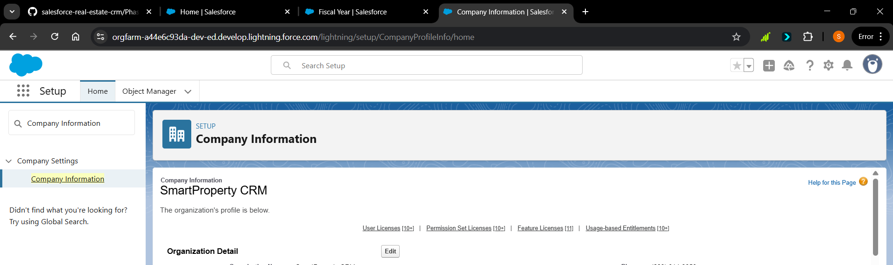

---

## 🔹 Step 3: Company Profile Setup
- Company Name → SmartProperty CRM  
- Currency → INR (₹)  
- Locale → English (India)  
- Time Zone → (GMT +5:30) India Standard Time  

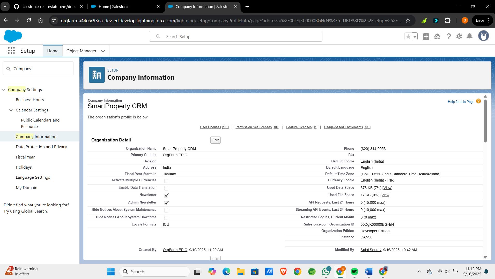

---

## 🔹 Step 4: Business Hours & Holidays
Defined working hours and holidays.  

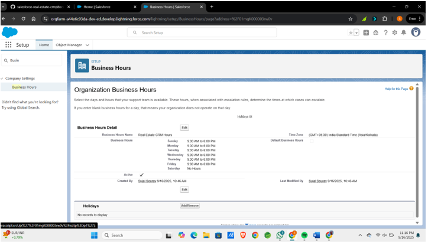

---

## 🔹 Step 5: Fiscal Year Settings
Configured **Standard Fiscal Year (April to March)**.  

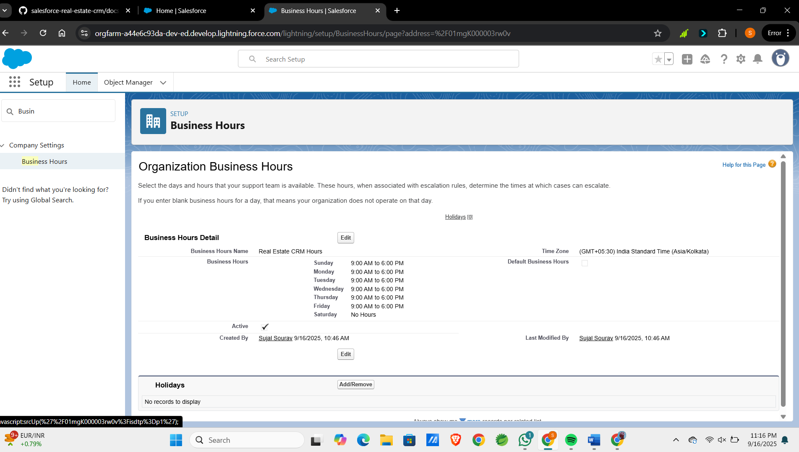

---

## 🔹 Step 6: User Setup & Licenses
Created sample users:  
- Sales Agent (Standard Salesforce License)  
- Property Manager (Salesforce Platform License)  
- Sales Manager (Standard Salesforce License)  

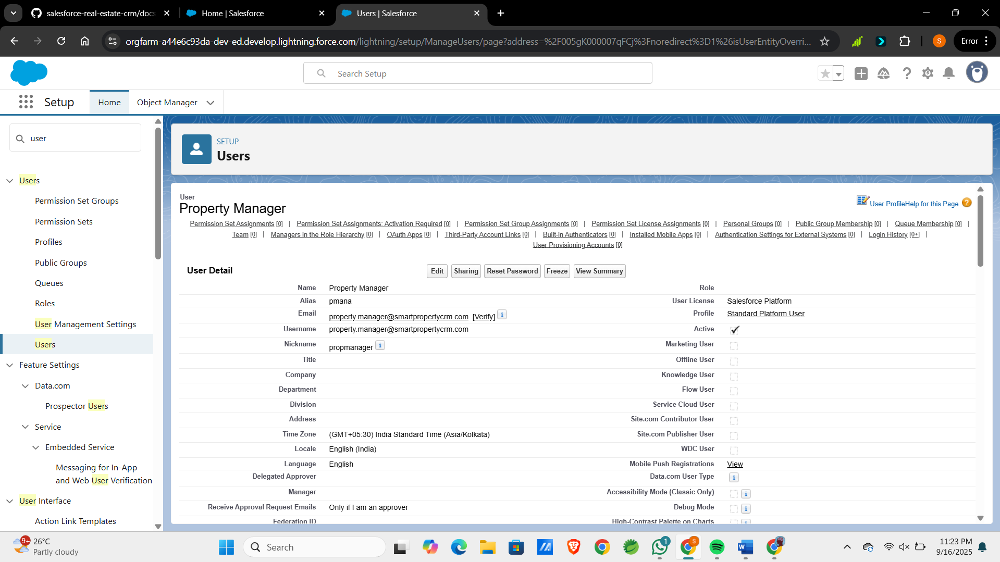

---

## 🔹 Step 7: Profiles
Cloned **Standard User** → Created **Sales Agent Profile**.  

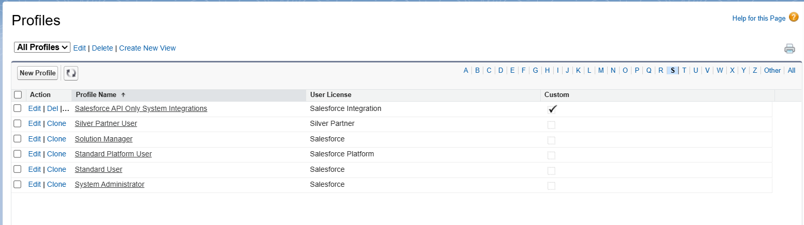

---

## 🔹 Step 8: Roles (Hierarchy)
Defined hierarchy:  
- Executive (Top)  
- Sales Manager  
- Sales Agent  

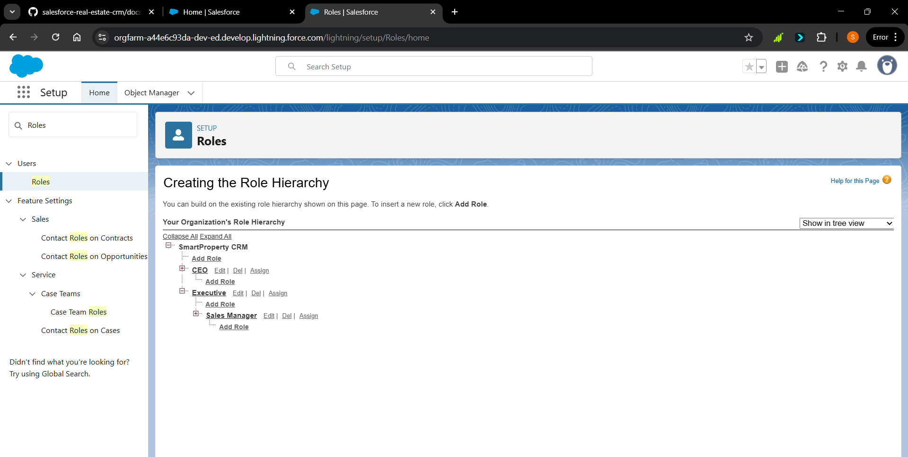

---

## 🔹 Step 9: Permission Sets
Created Permission Set → **Property Management Access**.  

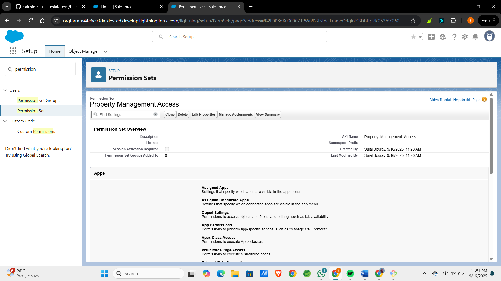

---

## 🔹 Step 10: Organization-Wide Defaults (OWD)
- Leads → Private  
- Opportunities → Private  
- Property (custom object – Phase 3) → Public Read/Write  

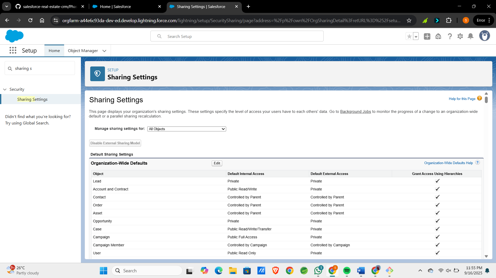

---

## 🔹 Step 11: Sharing Rules
Added **Sharing Rules** for cross-team lead visibility.  

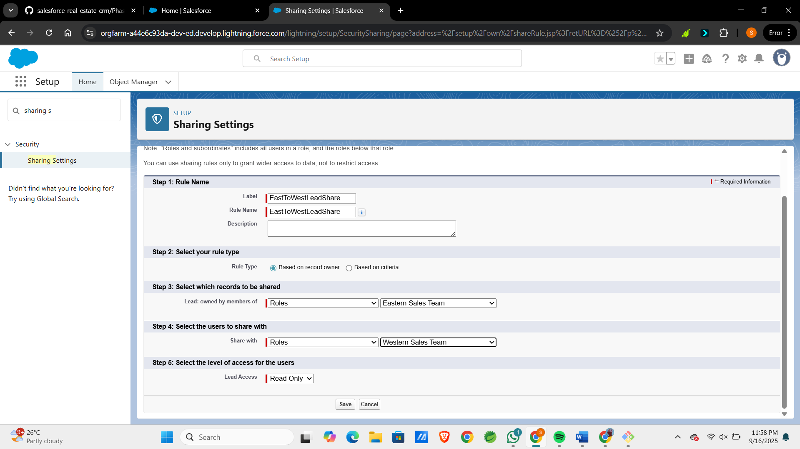

---

## 🔹 Step 12: Login Access Policies
Enabled **Admin login as any user**.  

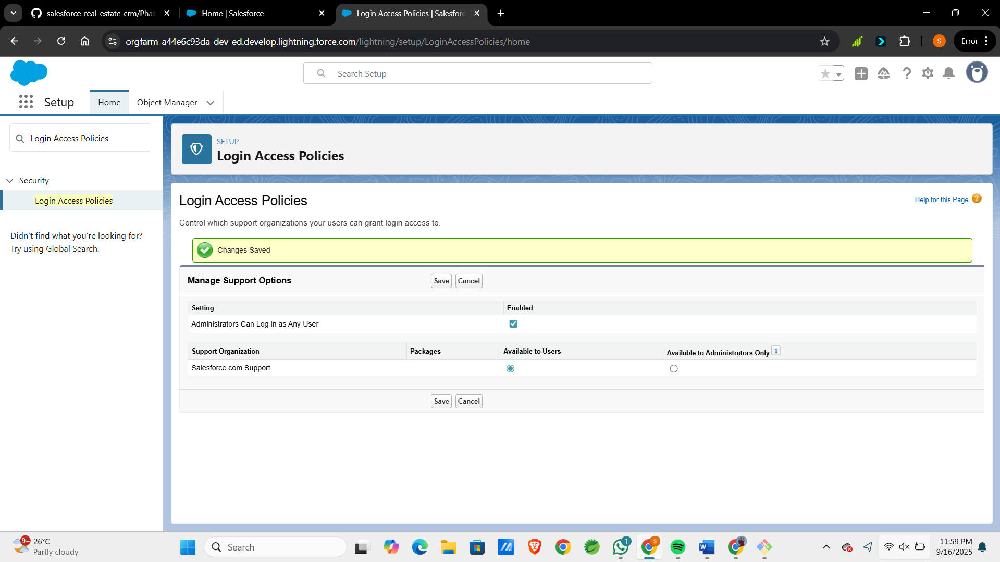

---

# ✅ Proof of Work Summary
- Org setup completed successfully  
- 12 configuration steps documented with screenshots  
- Ready for Phase 3 (Data Modeling)
